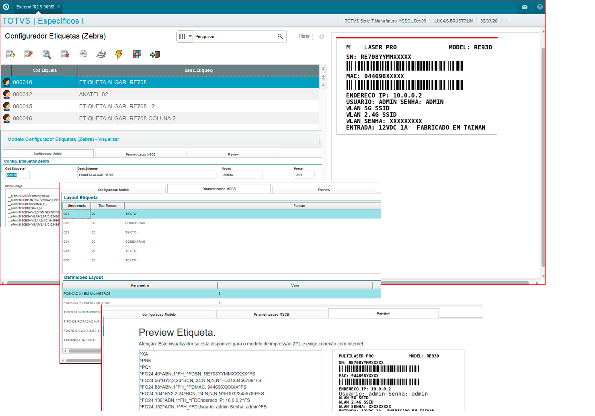

# Configurador Etiqueta Zebra :newspaper:

Você desenvolvedor Protheus já precisou criar um modelo de etiqueta na mão ?

Se sim, você sabe bem como é complicado trabalhar com as funções MSCB sem obter uma prévia de como a etiqueta está ficando, fora o tempo que você perde compilando um novo ajuste e fazendo a impressão do modelo, rsrs. Afim de minimizar este trabalho desenvolvi este configurador, ou seja, através dele é possível trazer as funções MSCB para uma interface ADVPL e conforme você vai parametrizando é gerado o código nativo da impressora "ZPL", permitindo que um pré-visualizador de terceiro "http://labelary.com/viewer.html" embutido no ERP se responsabilize com a renderização da etiqueta.




O interessante que este configurador foi codificado utilizando o padrão MVC e de funções\classes que podem ser utilizadas em seus projetos. Vejam só.

* CRUD Advpl MVC + opção de cópia.
* Carga de um modelo de dados a partir de um arquivo JSON.
* Classes para geração de código ZPL.
* Classe TWFHTML para manipulação do HTML modelo.
* Classe FWFormContainer permite a divisão de uma janela "MSDIALOG" usando o mesmo conceito de BOX (View MVC).
* Classe TBitmap para obter um visualizador do modelo finalizado.
* Classe FWButtonBar, para barra de botões personalizada.
* Aplicação de CSS em um grid MVC.
* Manipulação de diretórios.
* Uso de macro-execução para blocos de códigos.
* Uso de função para realizar testes em portas, interface serial.

Atenção: Este projeto foi desenvolvido na release 12.1.17 e melhorias são bem vindas.

# Como utilizar?

```
1. Compile os fontes que estão no diretório /src 
2. Copie o diretório ./resource/zebra para dentro do seu RootPath.
3. Appenda as tabelas utilizadas no configurador. SX2, SX3, SIX, SXB e SX5 em DBF/CTREE ( ./resource/zebra/dbf/ ou /resource/zebra/ctree)
```

# Próximas atualizações:

- [ ] Substituição do metódo de atualização do WebPreview por webservice.
- [ ] Inclusão de consulta padrão com os modelos de impressora e parâmetros MCSB.
- [ ] Adição de retângulos ao Preview para referenciar imagens da etiqueta. 
- [ ] Inclusão de novos modelos de etiqueta.
- [x] Substituição do componente TIBrowse pelo TwebEngine. (TIBrowse foi descontinuado nas releases superiores a 12.1.17)


## Tecnologias

Projeto desenvolvido em:

- [Advpl](https://tdn.totvs.com/display/public/PROT/AdvPl+utilizando+MVC)
- [HTML](https://pt.wikipedia.org/wiki/HTML)
- [Javascript](https://pt.wikipedia.org/wiki/JavaScript)

Framework 

- [MVC](https://tdn.totvs.com/display/public/PROT/AdvPl+utilizando+MVC)